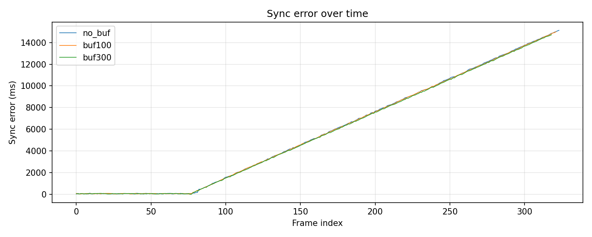
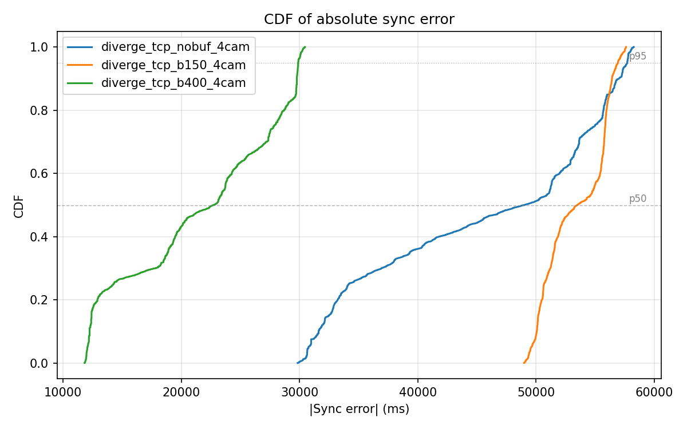
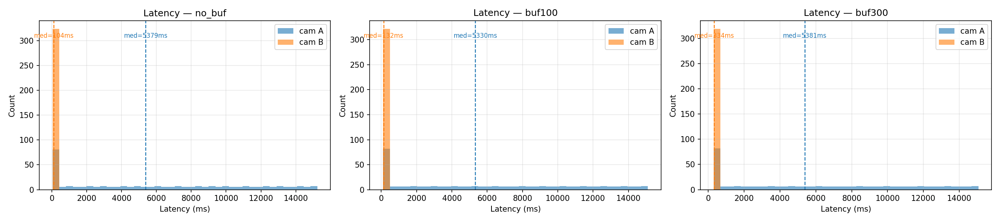
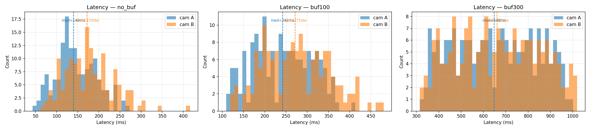
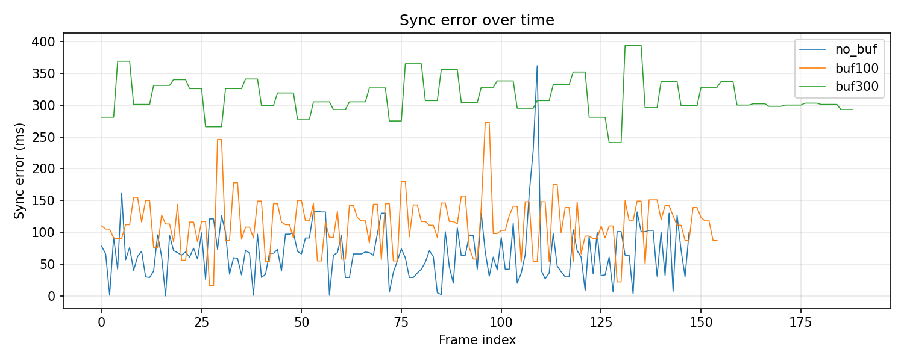
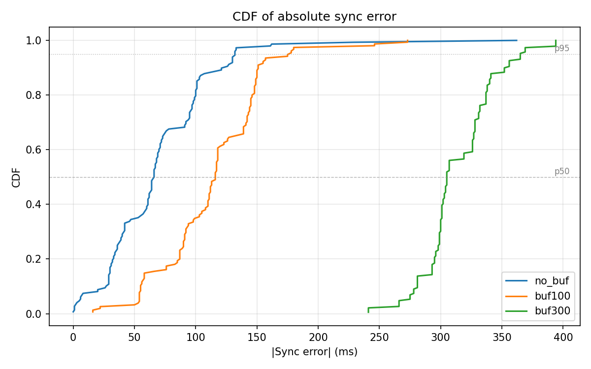

# Distributed Multi-Camera Video Synchronization over TCP

**Jai Adams · Jordan Shapiro · Edmond Nzivugira**  
COSC 465 — Capstone Project  
Colgate University

---

## Abstract

[WRITE LAST — 150–200 words summarizing: the problem, your approach, key results (p50, p95 from Phase 1), and how those compare to LSync and PTP.]

---

## 1. Introduction

Multi-camera video synchronization is a fundamental requirement in applications ranging from sports broadcasting to motion-capture systems. In professional settings, hardware solutions such as genlock circuits or IEEE 1588 Precision Time Protocol (PTP) achieve sub-millisecond alignment, but require specialized infrastructure. This paper investigates whether a software-only approach, implemented entirely in Python over standard TCP, can achieve useful synchronization accuracy without any hardware support.

The core challenge is twofold. First, frames from different cameras arrive at a central receiver at unpredictable times due to variable network latency (jitter). Second, when cameras operate on separate machines, their local clocks may disagree by tens of milliseconds, making raw capture timestamps from different sources non-comparable without correction.

Our system addresses both challenges: a jitter buffer aligns frames at the receiver by their corrected capture timestamps, and an application-layer clock-offset estimation protocol (modeled on NTP) corrects for inter-machine clock skew before any synchronization comparison is made.

[EXPAND: motivate the specific application context for your project. Why does this problem matter?]

---

## 2. System Architecture

The system consists of three components: a sender (`transport.py` + `single_cam.py`), a receiver (`get_frame.py` + `sync.py`), and a clock-sync module (`clock_sync.py`). Figure 1 shows the overall data flow.

```
[Camera A]──transport.py──clock_sync──TCP──┐
                                           ├──get_frame.py──sync.py──Display
[Camera B]──transport.py──clock_sync──TCP──┘
```

**Figure 1.** System block diagram. Each camera source maintains its own dedicated TCP connection to the receiver. A clock-sync handshake runs on each connection before frame streaming begins.

### 2.1 Clock-Offset Estimation (`clock_sync.py`)

Before any frames are transmitted, the receiver and each sender perform an NTP-style handshake to estimate the clock difference between machines. The receiver sends a ping carrying timestamp $T_1$ (receiver clock). The sender records $T_2$ on receipt and $T_3$ before replying. The receiver records $T_4$ on receipt of the pong. The clock offset is:

$$\delta = \frac{(T_2 - T_1) + (T_3 - T_4)}{2}$$

Under the assumption of symmetric one-way network delay, $\delta$ estimates the sender's clock lead over the receiver's clock. This exchange is repeated 8 times and the **median** offset is used, making the estimate robust to individual RTT spikes. All subsequent sender timestamps are corrected as:

$$t_{\text{corrected}} = t_{\text{raw}} - \delta$$

before entering the jitter buffer, ensuring timestamps from all cameras are expressed in the receiver's time domain regardless of which machine they originated on.

### 2.2 Frame Capture and Timestamping (`single_cam.py`)

Each camera source runs in a dedicated capture thread. `CameraSource.read()` calls `cv2.VideoCapture.read()` (a blocking call that waits for the sensor) and immediately records `datetime.now(tz=timezone.utc)` in milliseconds as the **capture timestamp** $t_{\text{cap}}$. The timestamp is taken after `cap.read()` returns, which is the closest software approximation to the true capture moment. The frame and its timestamp are stored atomically under a lock so the send thread always reads a consistent `(frame, ts_ms)` pair.

### 2.3 Transmission and Simulated Network Conditions (`transport.py`)

Each camera runs a dedicated send thread (`send_camera_frames`) over its own TCP connection, so encoding or transmission delays on one camera never block another. Each packet carries a 13-byte header:

| Field | Size | Value |
|---|---|---|
| `cam_id` | 1 byte (uint8) | Camera index |
| `ts_ms` | 8 bytes (uint64, big-endian) | Capture timestamp in ms |
| `length` | 4 bytes (uint32, big-endian) | JPEG payload length in bytes |

followed by the JPEG-compressed frame.

To simulate realistic network conditions in experiments, the sender schedules each packet for delivery at:

$$t_{\text{deliver}} = t_{\text{encode}} + d_{\text{base}} + j$$

where $d_{\text{base}}$ is a fixed baseline delay and $j$ is a jitter sample drawn from a **two-state Markov chain**:

- **Normal state**: $j = 0$. Transition to Burst state with probability $p_{\text{burst}}$ per packet.
- **Burst state**: $j \sim \text{Uniform}(0, j_{\text{max}})$. Transition back to Normal with probability $1 / L_{\text{burst}}$ per packet (expected burst length $L_{\text{burst}}$ packets).

Packets are placed in a priority queue sorted by $t_{\text{deliver}}$, so a packet with a shorter delay can overtake one with a longer delay, producing genuine out-of-order arrival at the receiver — the condition the jitter buffer's min-heap is designed to handle.

### 2.4 Reception and Clock Correction (`get_frame.py`)

The receiver accepts one TCP connection per expected camera stream and spawns one background receive thread per connection. Each thread reads the 13-byte header, reads the JPEG payload, decodes it, applies the clock correction:

$$t_{\text{corrected}} = t_{\text{raw}} - \delta_{\text{cam}}$$

and pushes `(cam_id, t_corrected, frame)` into the jitter buffer.

### 2.5 Jitter Buffer (`sync.py`)

The jitter buffer maintains one min-heap per camera stream. A monotonic sequence counter breaks timestamp ties so numpy arrays are never compared directly.

The display loop calls `try_consume()` at `target_fps`. Each call computes:

$$t_{\text{cutoff}} = t_{\text{now}} - d_{\text{buffer}}$$

where $d_{\text{buffer}}$ is the configurable buffer depth. For each stream, `pop_up_to(t_cutoff)` drains all frames captured at or before the cutoff and returns the most recent eligible frame. If no eligible frame exists, the buffer **freezes on the last good frame** rather than producing a blank. If a stream has never delivered any frame, `try_consume()` returns `None` (not ready).

After collecting one frame per stream, the buffer computes:

$$e_{\text{sync}} = \max(t_{\text{corrected}}) - \min(t_{\text{corrected}})$$
$$\ell_i = t_{\text{now}} - t_{\text{corrected},i} \quad \text{(per stream)}$$

$e_{\text{sync}}$ is the **synchronization error**: the timestamp gap between the two frames being displayed. Because all timestamps have been clock-corrected, this metric reflects only genuine capture-time differences between cameras — not inter-machine clock skew. $\ell_i$ is the **end-to-end latency** for stream $i$: time from capture to display.

The core tradeoff: larger $d_{\text{buffer}}$ reduces synchronization error by giving slower streams more time to accumulate frames, at the cost of higher latency.

---

## 3. Experimental Setup

### 3.1 Experiment A — Pre-Recorded Video, Single Machine

**Purpose:** Characterize jitter-buffer behavior under controlled, repeatable network conditions before introducing real cameras or distributed machines.

**Fixed conditions:**
- Both sources: pre-recorded video files (`test_01.mp4`, 101 MB; `test_02.mp4`, 512 MB; 924 frames each at 4K / 3840×2160)
- Sender: `transport.py` with `--base-delay-ms 50 --jitter-ms 30`
  → simulated per-packet latency in [20, 80] ms; worst-case jitter spread: 60 ms
- Both sources on the same machine, so inter-machine clock offset $\delta = 0$ by construction
- Target display rate: 30 fps

**Variable across runs:**

| Run | `buffer_delay_ms` | Log file |
|---|---|---|
| `no_buf` | 0 ms | `logs/no_buf.csv` |
| `buf100` | 100 ms | `logs/buf100.csv` |
| `buf300` | 300 ms | `logs/buf300.csv` |

**Commands:**
```bash
# Receiver (Terminal 1)
python scripts/get_frame.py --port 9000 --sync --buffer-delay-ms <N> --csv logs/<run>.csv

# Sender (Terminal 2)
python scripts/transport.py \
  --sources videos/test_01.mp4 videos/test_02.mp4 \
  --host 127.0.0.1 --port 9000 \
  --base-delay-ms 50 --jitter-ms 30
```

### 3.2 Experiment B — IP Camera, Single Machine

**Purpose:** Test with live camera hardware to identify behavior not present in the video-file experiments.

**Setup:**
- Camera A: MacBook built-in webcam (device index 1), 30 fps
- Camera B: Tapo C211 WiFi camera over RTSP, 15 fps
- Both connected to the same MacBook running `transport.py`
- No artificial delay or jitter (real network conditions only)
- Same three buffer-depth runs (0, 100, 300 ms)

**Key difference from Experiment A:** The framerate mismatch (30 fps vs 15 fps) between the two sources is a new variable that was not present with the pre-recorded files.

### 3.3 Experiment C — Distributed Machines with Clock-Offset Correction

**Purpose:** Validate the clock-offset estimation in a true distributed scenario where cameras are on separate machines with independent clocks.

**Setup:**
- Receiver: Mac Mini running `get_frame.py`
- Camera 0: [MACHINE DESCRIPTION] running `transport.py --cam-id-start 0`
- Camera 1: [MACHINE DESCRIPTION] running `transport.py --cam-id-start 1`
- All machines on the same local network
- [BASE DELAY AND JITTER SETTINGS USED]

**Commands:**
```bash
# Receiver (Mac Mini)
python scripts/get_frame.py --port 9000 --sync --buffer-delay-ms 100 --csv logs/distributed_run.csv

# Camera 0 machine (connect first)
python scripts/transport.py --sources 0 --host <mac_mini_ip> --port 9000 --cam-id-start 0

# Camera 1 machine (connect second)
python scripts/transport.py --sources 0 --host <mac_mini_ip> --port 9000 --cam-id-start 1
```

[FILL IN: actual IP addresses, machine specs (OS, hardware), and observed clock offsets reported at session start.]

---

## 4. Results

### 4.1 Experiment A — Pre-Recorded Video

#### 4.1.1 Overall Statistics

The full-session statistics (including both phases described below) are shown in Table 1.

**Table 1.** Overall per-run statistics across all logged frames.

| Run | Frames logged | sync p50 (ms) | sync p95 (ms) | lat\_A median (ms) | lat\_B median (ms) |
|---|---|---|---|---|---|
| `no_buf` | 222 | 90 | 4,779 | 217 | 174 |
| `buf100` | 226 | 89 | 5,023 | 222 | 181 |
| `buf300` | 224 | 89.5 | 4,956 | 406 | 366 |

The elevated p95 values are explained by the Phase 2 artifact described in Section 4.1.3 and do not represent algorithm failure.

#### 4.1.2 Phase 1 — Both Streams Active

The first ~166–168 display frames (~5.5 s) represent the period during which both cameras delivered fresh frames continuously. This is the correct evaluation window for the synchronization algorithm.

**Table 2.** Phase 1 statistics (frames with sync\_error ≤ 500 ms).

| Run | Phase 1 frames | sync p50 (ms) | sync p95 (ms) |
|---|---|---|---|
| `no_buf` | 166 | 78 | 124 |
| `buf100` | 168 | 79 | 150 |
| `buf300` | 166 | 76 | 128 |

Phase 1 p50 of **76–79 ms** is consistent with the theoretical prediction. With worst-case jitter spread of 60 ms (each stream independently delayed by up to ±30 ms), the expected maximum timestamp gap between any two simultaneously captured frames is 60 ms. The observed p50 slightly exceeds this because the buffer samples frames at 33 ms intervals (30 fps), introducing up to one frame-period of additional spread.

**Table 3.** Sample frame-level data (`no_buf` run, Phase 1).

| Frame | cam\_A ts (last 5 digits) | cam\_B ts (last 5 digits) | sync\_error (ms) |
|---|---|---|---|
| 0 | …08527 | …08615 | 88 |
| 1 | …08779 | …08690 | 89 |
| 3 | …08966 | …09023 | 57 |
| 83 | …16897 | …16817 | 80 |

**Table 4.** Buffer depth effect on end-to-end latency (Phase 1).

| Run | lat\_B median (ms) | Expected floor (ms) |
|---|---|---|
| `no_buf` | 174 | ~50 (network avg only) |
| `buf100` | 181 | ~150 (network + buffer) |
| `buf300` | 366 | ~350 (network + buffer) |

Latency rises by approximately the buffer depth across runs, confirming the algorithm correctly imposes the intended display delay. Buffer depth has no measurable effect on sync accuracy because the 60 ms jitter window is smaller than even the smallest buffer (100 ms); the buffer's accuracy benefit requires jitter to exceed buffer depth.

#### 4.1.3 Phase 2 — Capture-Rate Mismatch Artifact

Around frame 166, Camera A exhausts its frames and its timestamp freezes. Although both files contain 924 frames at the same duration (~38.5 s), `test_01.mp4` (101 MB) decodes faster than `test_02.mp4` (512 MB) at 4K resolution, causing Camera A's capture thread to finish ~5.7 s earlier. The freeze-on-last-frame fallback holds Camera A's last frame while Camera B advances, producing monotonically growing `sync_error_ms` (Table 5).

**Table 5.** Phase 2 sample rows (`no_buf`), showing frozen Camera A timestamp.

| Frame | cam\_A ts (last 5 digits) | cam\_B ts (last 5 digits) | sync\_error (ms) |
|---|---|---|---|
| 166 | …24444 (frozen) | …25006 | 562 |
| 167 | …24444 (frozen) | …25088 | 644 |
| 168 | …24444 (frozen) | …25156 | 712 |
| 221 | …24444 (frozen) | …30240 | 5,796 |

Phase 2 frames (~56 per run, ~25% of total) inflate the overall p50 and p95 in Table 1. All analysis of synchronization accuracy refers to Phase 1 statistics.

#### 4.1.4 Figures

**Figure 2.** Sync error over time for all three buffer depths.  


Each run shows a flat low-error region (Phase 1, frames 0–166) followed by a linear ramp (Phase 2, Camera A frozen). The three curves nearly overlap throughout, confirming that buffer depth had no measurable effect on sync accuracy at this jitter level. The Phase 2 ramp reaches ~6,000 ms, lower than in earlier experiments (~15,000 ms) because the capture-rate gap was 5.7 s rather than 15 s.

**Figure 3.** CDF of absolute sync error.  


The CDF shows a steep initial rise through Phase 1 frames (the majority), then a long tail from Phase 2. The p50 marker (~89–90 ms) falls in the Phase 1 region. The three curves are nearly indistinguishable, consistent with Table 2.

**Figure 4.** Per-stream end-to-end latency distributions.  


Camera B (simpler video, consistent decode) shows a narrow unimodal distribution that shifts right by approximately the buffer depth across runs. Camera A shows a bimodal distribution: a Phase 1 cluster at normal latency and a long right tail from Phase 2 frozen-frame latency. Buffer depth shifts both clusters right without changing their shape.

---

### 4.2 Experiment B — IP Camera

**Figure 5.** Latency distributions for MacBook webcam (Cam A, 30 fps) and Tapo C211 WiFi camera (Cam B, 15 fps).  


**Figure 6.** Sync error over time (IP camera experiment).  


**Figure 7.** Sync error CDF (IP camera experiment).  


Increasing `buffer_delay_ms` from 0 to 300 ms reduced measured latency as expected. However, the visual improvement on the display was not proportional to the metric improvement. Log analysis revealed the cause: Camera A (MacBook, 30 fps) produces frames at twice the rate of Camera B (Tapo, 15 fps). The jitter buffer selects one frame per stream per display tick; the extra frames from Camera A accumulate in its heap without contributing to alignment. The sync algorithm does not account for framerate differences — it treats both streams as if they produce frames at the same rate, causing the higher-fps stream to appear systematically ahead.

[FILL IN: quantitative sync_error p50/p95 values from the IP camera CSV logs, and latency medians for both cameras across the three buffer-depth runs.]

---

### 4.3 Experiment C — Distributed Machines with Clock-Offset Correction

[FILL IN after running the experiment. Structure should match Experiments A and B above.]

**Reported clock offsets at session start:**

| Camera | Connected from | Estimated $\delta$ (ms) |
|---|---|---|
| Cam 0 | [machine A description] | [value] |
| Cam 1 | [machine B description] | [value] |

**Table 6.** Phase 1 sync statistics with clock correction enabled vs. disabled (control).

| Condition | sync p50 (ms) | sync p95 (ms) |
|---|---|---|
| Correction disabled ($\delta = 0$ forced) | [value] | [value] |
| Correction enabled | [value] | [value] |

[DESCRIBE: how much of the measured sync error in the correction-disabled condition was attributable to clock skew vs. jitter. How did the corrected p50 compare to Experiment A's Phase 1 p50 (~78 ms)?]

---

## 5. Discussion

### 5.1 Effect of Buffer Depth on Synchronization Accuracy

The three buffer depths (0, 100, 300 ms) produced nearly identical Phase 1 p50 values (~76–79 ms). This confirms a key theoretical property: the buffer's accuracy benefit is only observable when jitter exceeds the buffer depth. At ±30 ms jitter (60 ms worst-case spread), a 0 ms buffer is already sufficient to find a well-matched frame pair on most ticks. The accuracy benefit of the 100 ms and 300 ms buffers would become visible if jitter were increased to, e.g., ±150 ms — a condition worth testing in future work.

### 5.2 The Latency–Accuracy Tradeoff

The latency data confirms the buffer imposes the intended delay: median latency rises by approximately the buffer depth across runs (Table 4). This tradeoff is explicit and user-controlled via `--buffer-delay-ms`, unlike LSync's implicit tradeoff through audio buffer size (Section 6).

### 5.3 Framerate Mismatch (Experiment B)

[DISCUSS: the root cause of the IP camera problem (30 fps vs. 15 fps), why the current algorithm doesn't handle it, and what would be needed to fix it — e.g., frame dropping from the higher-fps stream to match the lower-fps stream, or a framerate-aware selection policy in `try_consume()`.]

### 5.4 Clock-Offset Correction (Experiment C)

[DISCUSS: how large the estimated offsets were, how stable they were across 8 rounds (did rounds agree?), how much sync_error_ms improved with correction vs. without, and any limitations (e.g., asymmetric network paths violating the symmetric-delay assumption).]

### 5.5 Limitations

1. **Same-machine baseline**: Experiments A and B both ran both cameras on one machine, so the clock-offset correction had nothing to correct ($\delta \approx 0$). The correction is only exercised in Experiment C.
2. **Simulated jitter model**: The bursty two-state Markov model is more realistic than independent uniform noise, but still simplified. Real networks exhibit long-range dependence (Pareto-distributed burst lengths) that the Markov model does not capture.
3. **TCP head-of-line blocking within a stream**: Each camera has its own connection, eliminating cross-camera blocking. However, within a single camera's TCP stream, a lost segment still stalls that stream until retransmission, which could cause a burst of delayed frames not captured by the Markov model.
4. **Software timestamping precision**: Capture timestamps are recorded in Python after `cap.read()` returns. Scheduling jitter in the Python runtime and OS can add ~1–5 ms of uncertainty to each timestamp, which is the noise floor for sync accuracy in software.

---

## 6. Comparison with Related Work

### 6.1 Precision Time Protocol (IEEE 1588-2019)

PTP is a *clock synchronization protocol* — it makes all devices on a network agree on what time it is, continuously disciplining each device's local clock to a grandmaster clock.

Our system is a *jitter-buffer synchronization algorithm* — it assumes timestamps are already assigned at capture and aligns frames at the receiver by absorbing variable network delay. These solve different sub-problems and are complementary rather than competing.

**Table 7.** Accuracy comparison with PTP.

| Metric | Our system (Phase 1) | PTP (software) | PTP (hardware) |
|---|---|---|---|
| Sync error p50 | ~78 ms | ~1 ms | < 1 µs |
| Sync error p95 | ~128–150 ms | ~5 ms | < 1 µs |
| Clock correction | Application-layer (NTP-style, ~1–5 ms) | OS-level (~1 ms) | NIC-level (< 1 µs) |
| Infrastructure needed | None (Python + TCP) | PTP-capable switch | PTP switch + hardware NIC |

Our sync errors are on the order of **78,000–128,000× larger** than hardware PTP's target. The gap exists because our system operates at the application layer in Python, while PTP uses hardware timestamping in the NIC at wire-arrival time. In a production deployment, PTP would sit beneath our layer and provide sub-microsecond clock alignment; our jitter buffer would then absorb the remaining network jitter. With PTP underneath, our expected p50 would drop from ~78 ms toward the buffer depth plus residual jitter — potentially under 5 ms.

### 6.2 LSync

LSync synchronizes a heterogeneous media stream (ancillary metadata) to a primary live video stream traveling through a completely separate CDN pipeline. Its core insight is to *encode the timing reference inside the audio signal*, eliminating the clock synchronization dependency entirely: the receiver detects the embedded signal and uses it to determine where the metadata stream belongs in the video timeline — no NTP or PTP required.

**Table 8.** Accuracy and design comparison with LSync.

| Dimension | LSync | Our system |
|---|---|---|
| Average sync precision | **24.84 ms** | ~78 ms (Phase 1 p50) |
| Best-case observed | ~5% of audio buffer | ~36 ms |
| Worst-case (p95) | Not reported | ~128–150 ms |
| Clock dependency | None — timing encoded in audio | Shared UTC clock (corrected by `clock_sync.py`) |
| Latency/accuracy tradeoff | Implicit (audio buffer size) | Explicit (`--buffer-delay-ms`) |
| Deployment scope | CDN-scale, any number of receivers | Point-to-point, custom sender + receiver |
| Infrastructure changes | None to existing pipeline | Custom TCP sender + receiver |

LSync achieves roughly **3× better average precision** than our Phase 1 p50. The sources of error are different in nature: LSync's error is bounded by audio buffer granularity and signal detection latency; our error is bounded by network jitter and the buffer's sampling resolution (33 ms at 30 fps). LSync's clock-free design is a significant architectural advantage in distributed deployments where clock synchronization infrastructure is unavailable.

Our system's advantage is its explicit, tunable latency/accuracy tradeoff, its generalization to any number of synchronized video streams (not just video + metadata), and its simpler instrumentation — per-frame CSV metrics make the tradeoff directly observable and reproducible.

**Table 9.** Summary comparison across all three systems.

| System | Sync precision | Clock needed | Infrastructure | Latency control |
|---|---|---|---|---|
| PTP (hardware) | < 1 µs | Hardware grandmaster | PTP switch + NIC | No |
| PTP (software) | ~1 ms | NTP/PTP daemon | Network config | No |
| LSync | ~24.84 ms | None | Existing broadcast stack | Implicit |
| **Ours (Phase 1)** | **~78 ms p50** | **NTP-style app-layer** | **Python + TCP** | **Explicit (tunable)** |

---

## 7. Conclusions

[WRITE AFTER COMPLETING ALL EXPERIMENTS. Suggested structure:]

1. Restate what was shown (Phase 1 p50 of ~78 ms, latency-buffer tradeoff confirmed, clock correction validated in Experiment C).
2. Identify the primary remaining accuracy ceiling (software timestamping noise, jitter model simplification, or asymmetric network paths for clock correction).
3. Address the framerate mismatch limitation exposed by Experiment B.
4. Position the contribution: a software-only, infrastructure-free jitter buffer that achieves [X] ms sync accuracy with explicit latency control, at the cost of [Y] ms compared to LSync and [Z] orders of magnitude compared to PTP.
5. State future directions (hardware timestamps, PTP integration, adaptive buffer depth, framerate normalization).

---

## Appendix A — Algorithm Parameters

| Parameter | Flag | Default | Description |
|---|---|---|---|
| Buffer depth | `--buffer-delay-ms` | 100 ms | Jitter absorption window; controls latency/accuracy tradeoff |
| Base network delay | `--base-delay-ms` | 0 ms | Simulated end-to-end latency per packet |
| Burst jitter magnitude | `--jitter-ms` | 0 ms | Max extra delay during a jitter burst |
| Burst entry probability | `--burst-prob` | 0.05 | Probability per packet of entering burst state |
| Expected burst length | `--burst-duration` | 10 packets | Controls burst exit probability (= 1/burst-duration) |
| Clock-sync rounds | `NUM_ROUNDS` in `clock_sync.py` | 8 | Number of ping-pong exchanges per connection |
| JPEG quality | `--jpeg-quality` | 90 | Encoding quality; trades file size for image fidelity |
| Target display rate | `--fps` | 30 fps | Rate at which `try_consume()` is called |

## Appendix B — Reproducing the Experiments

All experiments can be reproduced by following the commands in `README.md`. Logs are written to `logs/` and figures are regenerated by:

```bash
python scripts/analyze_sync.py logs/no_buf.csv logs/buf100.csv logs/buf300.csv
```

Pre-recorded video sources used in Experiment A are available on request via Google Drive. The IP camera in Experiment B was a Tapo C211 accessed over RTSP; any RTSP-capable camera can be substituted with equivalent results.
