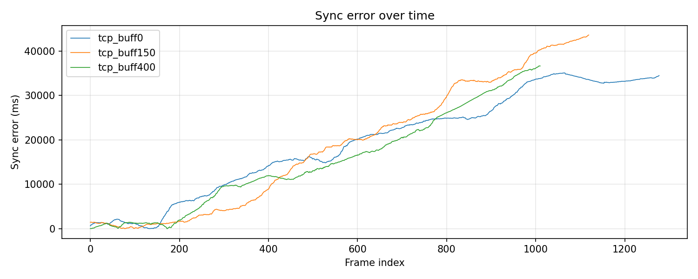
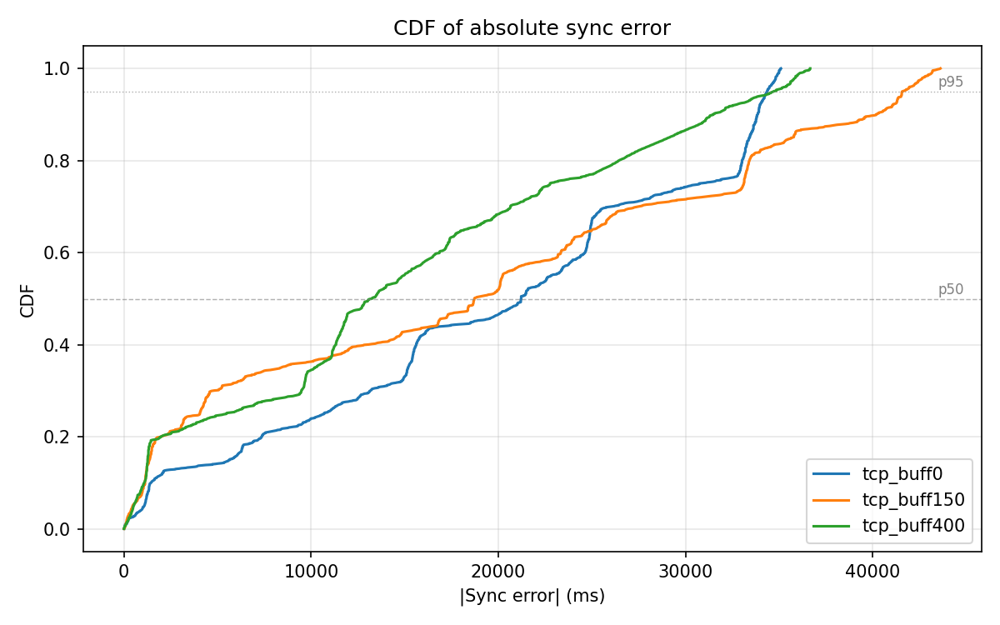
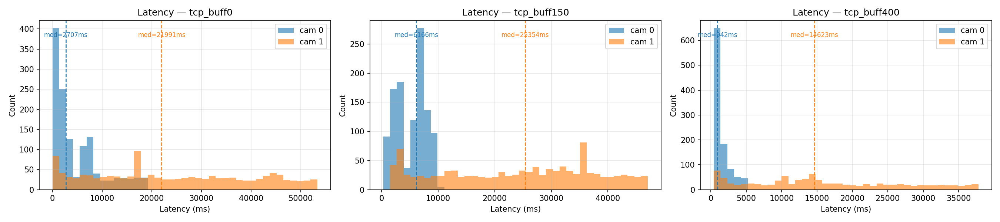
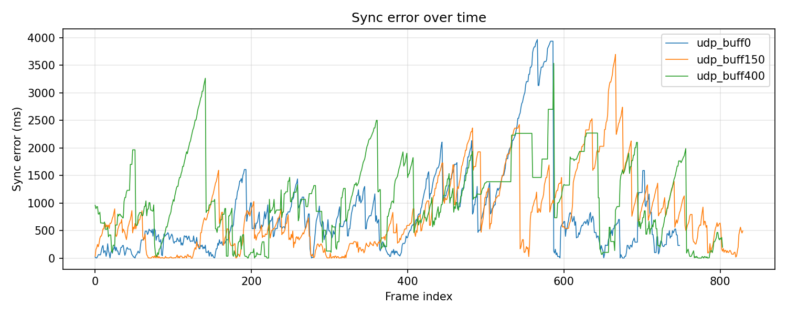
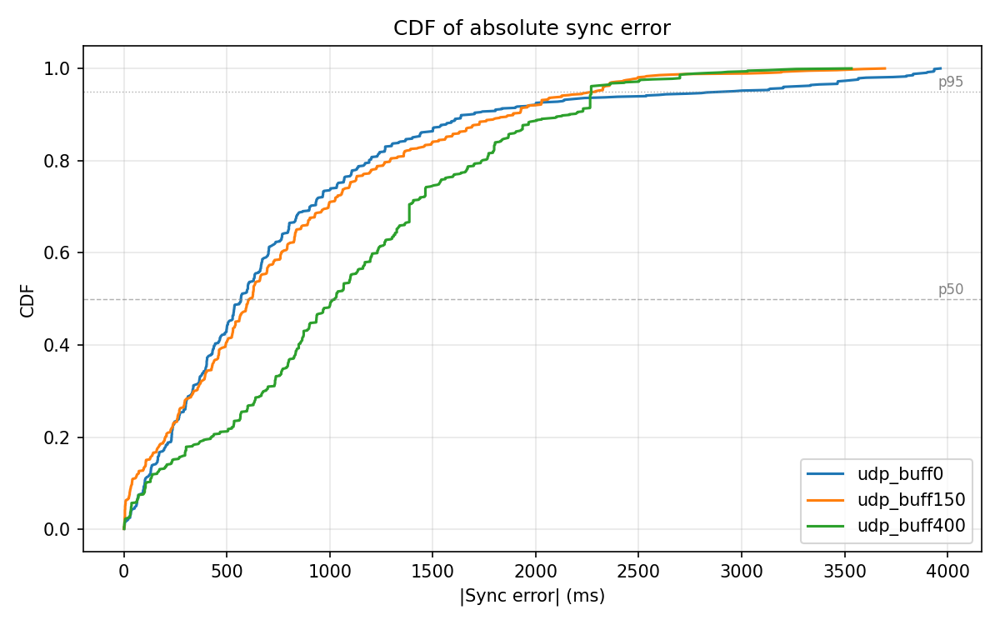
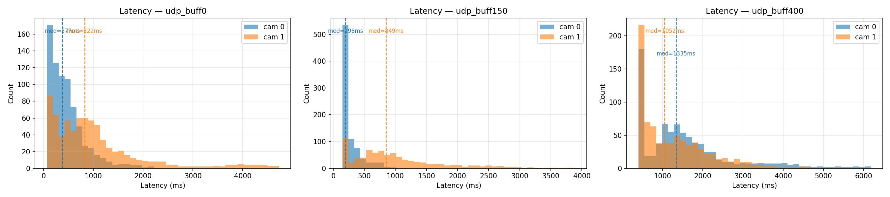
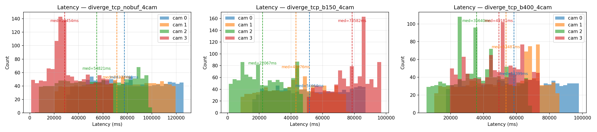
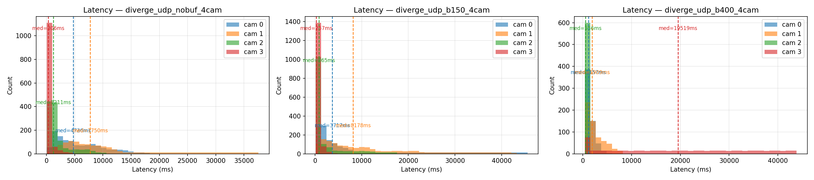
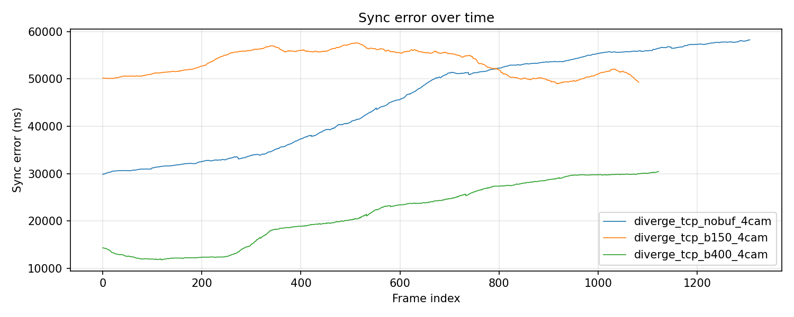
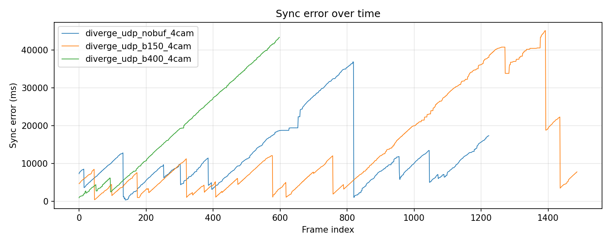

# Distributed Multi-Camera Video Synchronization over TCP and UDP

**Jai Adams · Jordan Shapiro · Edmond Nzivugira**  
COSC 465 — Capstone Project  
Colgate University

---

## Abstract

Synchronizing live video from multiple distributed cameras without dedicated timing hardware remains difficult because network jitter, packet loss, and inter-device clock skew can all misalign frames. We present a software-only Python system that combines per-camera clock-offset estimation (NTP-style handshake) with a receiver-side jitter buffer that aligns frames by corrected capture timestamps. The system was evaluated over real ad-hoc WiFi using both TCP and UDP at multiple buffer depths (0, 150, 400 ms) in two-camera and four-camera settings. In the two-camera experiment, TCP quickly collapsed into head-of-line blocking, yielding only 33–59 valid Phase 1 frames. UDP sustained substantially longer Phase 1 operation (170–337 frames) and showed the expected buffer tradeoff: better alignment with deeper buffering. The best Phase 1 result was achieved with UDP at 400 ms buffering (p50 = 129 ms, p95 = 427 ms), compared with UDP at 0 ms (p50 = 236 ms, p95 = 469 ms). Relative to prior work, our best median error is about 5× higher than LSync (24.84 ms) and orders of magnitude above IEEE 1588 PTP (<1 µs), but the proposed method requires only commodity devices and no specialized synchronization hardware.

---

## 1. Introduction

Multi-camera video synchronization is a fundamental requirement in applications ranging from sports broadcasting to motion-capture systems. In professional settings, hardware solutions such as genlock circuits or IEEE 1588 Precision Time Protocol (PTP) achieve sub-millisecond alignment, but require specialized infrastructure. This paper investigates whether a software-only approach, implemented entirely in Python over standard TCP or UDP, can achieve useful synchronization accuracy without any hardware support.

The core challenge is twofold. First, frames from different cameras arrive at a central receiver at unpredictable times due to variable network latency (jitter). Second, when cameras operate on separate machines, their local clocks may disagree by tens of milliseconds, making raw capture timestamps from different sources non-comparable without correction.

Our system addresses both challenges: a jitter buffer aligns frames at the receiver by their corrected capture timestamps, and an application-layer clock-offset estimation protocol (modeled on NTP) corrects for inter-machine clock skew before any synchronization comparison is made.

This problem is particularly relevant in emerging real-world systems where deploying dedicated synchronization hardware is impractical or expensive. For example, in distributed security camera networks, misaligned video streams can hinder accurate event reconstruction across multiple viewpoints. Similarly, in autonomous vehicle perception, even modest temporal misalignment between cameras and sensors can hinder object tracking leading to unsafe decisions. In these contexts, a reliable software-based synchronization approach implements fully over python could enable scalable, low-cost deployments while still maintaining sufficient accuracy. Furthermore, it is worth exploring the use of TCP vs UDP with this synchronization software for different downstream applications, as the particular needs of these tasks may be better met through either reduced latency or increased synchronization accuracy.

---

## 2. System Architecture

The system consists of three components: a sender (`transport.py` + `single_cam.py`), a receiver (`get_frame.py` + `sync.py`), and a clock-sync module (`clock_sync.py`). Figure 1 shows the overall data flow.

```
[Camera A]──transport.py──clock_sync──TCP/UDP──┐
                                           ├──get_frame.py──sync.py──Display
[Camera B]──transport.py──clock_sync──TCP/UDP──┘
```

**Figure 1.** System block diagram. Each camera source maintains its own dedicated TCP/UDP connection to the receiver. A clock-sync handshake runs on each connection before frame streaming begins.

### 2.1 Clock-Offset Estimation (`clock_sync.py`)

Before any frames are transmitted, the receiver and each sender perform an NTP-style handshake to estimate the clock difference between machines. The receiver sends a ping carrying timestamp $T_1$ (receiver clock). The sender records $T_2$ on receipt and $T_3$ before replying. The receiver records $T_4$ on receipt of the pong. The clock offset is:

$$\delta = \frac{(T_2 - T_1) + (T_3 - T_4)}{2}$$

Under the assumption of symmetric one-way network delay, $\delta$ estimates the sender's clock lead over the receiver's clock. This exchange is repeated 8 times and the **median** offset is used, making the estimate robust to individual RTT spikes. All subsequent sender timestamps are corrected as:

$$t_{\text{corrected}} = t_{\text{raw}} - \delta$$

before entering the jitter buffer, ensuring timestamps from all cameras are expressed in the receiver's time domain regardless of which machine they originated on.

### 2.2 Frame Capture and Timestamping (`single_cam.py`)

Each camera source runs in a dedicated capture thread. `CameraSource.read()` calls `cv2.VideoCapture.read()` (a blocking call that waits for the sensor) and immediately records `datetime.now(tz=timezone.utc)` in milliseconds as the **capture timestamp** $t_{\text{cap}}$. The timestamp is taken after `cap.read()` returns, which is the closest software approximation to the true capture moment. The frame and its timestamp are stored atomically under a lock so the send thread always reads a consistent `(frame, ts_ms)` pair.

### 2.3 Transmission and Simulated Network Conditions (`transport.py`)

Each camera runs a dedicated send thread (`send_camera_frames`) over its own TCP/UDP connection, so encoding or transmission delays on one camera never block another. Each packet carries a 13-byte header:

| Field | Size | Value |
|---|---|---|
| `cam_id` | 1 byte (uint8) | Camera index |
| `ts_ms` | 8 bytes (uint64, big-endian) | Capture timestamp in ms |
| `length` | 4 bytes (uint32, big-endian) | JPEG payload length in bytes |

followed by the JPEG-compressed frame.

To simulate realistic network conditions in experiments, the sender schedules each packet for delivery at:

$$t_{\text{deliver}} = t_{\text{encode}} + d_{\text{base}} + j$$

where $d_{\text{base}}$ is a fixed baseline delay and $j$ is a jitter sample drawn from a **two-state Markov chain**:

- **Normal state**: $j = 0$. Transition to Burst state with probability $p_{\text{burst}}$ per packet.
- **Burst state**: $j \sim \text{Uniform}(0, j_{\text{max}})$. Transition back to Normal with probability $1 / L_{\text{burst}}$ per packet (expected burst length $L_{\text{burst}}$ packets).

Packets are placed in a priority queue sorted by $t_{\text{deliver}}$, so a packet with a shorter delay can overtake one with a longer delay, producing genuine out-of-order arrival at the receiver — the condition the jitter buffer's min-heap is designed to handle.

### 2.4 Reception and Clock Correction (`get_frame.py`)

The receiver accepts one TCP/UDP connection per expected camera stream and spawns one background receive thread per connection. Each thread reads the 13-byte header, reads the JPEG payload, decodes it, applies the clock correction:

$$t_{\text{corrected}} = t_{\text{raw}} - \delta_{\text{cam}}$$

and pushes `(cam_id, t_corrected, frame)` into the jitter buffer.

### 2.5 Jitter Buffer (`sync.py`)

The jitter buffer maintains one min-heap per camera stream. A monotonic sequence counter breaks timestamp ties so numpy arrays are never compared directly.

The display loop calls `try_consume()` at `target_fps`. Each call computes:

$$t_{\text{cutoff}} = t_{\text{now}} - d_{\text{buffer}}$$

where $d_{\text{buffer}}$ is the configurable buffer depth. For each stream, `pop_up_to(t_cutoff)` drains all frames captured at or before the cutoff and returns the most recent eligible frame. If no eligible frame exists, the buffer **freezes on the last good frame** rather than producing a blank. If a stream has never delivered any frame, `try_consume()` returns `None` (not ready).

After collecting one frame per stream, the buffer computes:

$$e_{\text{sync}} = \max(t_{\text{corrected}}) - \min(t_{\text{corrected}})$$
$$\ell_i = t_{\text{now}} - t_{\text{corrected},i} \quad \text{(per stream)}$$

$e_{\text{sync}}$ is the **synchronization error**: the timestamp gap between the two frames being displayed. Because all timestamps have been clock-corrected, this metric reflects only genuine capture-time differences between cameras — not inter-machine clock skew. $\ell_i$ is the **end-to-end latency** for stream $i$: time from capture to display.

The core tradeoff: larger $d_{\text{buffer}}$ reduces synchronization error by giving slower streams more time to accumulate frames, at the cost of higher latency.

---

## 3. Experimental Setup

### 3.1 Experiment A — UDP/TCP Behavior on 2 Cameras Running on 2 Machines

**Purpose:** Compare TCP and UDP transport under real distributed network conditions.The receiver hosts an ad-hoc WiFi network; both sender machines join it and stream their webcams. No artificial delay or jitter is added — all observed jitter comes from the real WiFi network.

**Fixed conditions:**

- Receiver: [MAcBook Pro] running `get_frame.py` (TCP) or
  `get_frame_copy.py` (UDP)
- Camera 0: [MacBook Air] — built-in webcam, ~30 fps
- Camera 1: [MacBook Pro] — built-in webcam, ~30 fps
- Network: ad-hoc WiFi (2.4 GHz ), no other active traffic
- No simulated delay or jitter (`--base-delay-ms 0`, `--jitter-ms 0`)

**Variable across runs:**

| Protocol | Run | `buffer_delay_ms` | Log file |
|---|---|---|---|
| TCP | `tcp_no_buf` | 0 ms | `2camlogs/tcp_buff0.csv` |
| TCP | `tcp_buf150` | 150 ms | `2camlogs/tcp_buff150.csv` |
| TCP | `tcp_buf400` | 400 ms | `2camlogs/tcp_buff400.csv` |
| UDP | `udp_no_buf` | 0 ms | `2camlogs/udp_buff0.csv` |
| UDP | `udp_buf150` | 150 ms | `2camlogs/udp_buff150.csv` |
| UDP | `udp_buf400` | 400 ms | `2camlogs/udp_buff400.csv` |

**Commands:**

```bash
# Receiver — TCP 
python scripts/get_frame.py --port 9000 --sync \
  --buffer-delay-ms <N> --csv 2camlogs/tcp_buff<N>.csv \
  --stream-ids 0 1

# Receiver — UDP 
python scripts/get_frame_copy.py --port 9000 --sync \
  --buffer-delay-ms <N> --csv 2camlogs/udp_buff<N>.csv \
  --stream-ids 0 1

# Camera 0 machine — TCP
python scripts/transport.py --sources 0 \
  --host <receiver_ip> --port 9000 --cam-id-start 0

# Camera 1 machine — TCP
python scripts/transport.py --sources 0 \
  --host <receiver_ip> --port 9000 --cam-id-start 1

# Camera 0 machine — UDP
python scripts/transport_udp.py --sources 0 \
  --host <receiver_ip> --port 9000 --cam-id-start 0

# Camera 1 machine — UDP
python scripts/transport_udp.py --sources 0 \
  --host <receiver_ip> --port 9000 --cam-id-start 1
```

### 3.2 Experiment B — 4 Cameras, TCP and UDP

**Purpose:** See how our synchronization algorithm scales with the addition of more cameras and across transport protocols.

**Setup:**
- Camera A: Tapo C211 WiFi camera, 15 fps no.1
- Camera B: Tapo C211 WiFi camera, 15 fps no.2
- Camera C: Edmond MacBook webcam
- Camera D: Jai MacBook webcam
- `transport.py` run from the two above MacBooks
- Jordan MacBook running `get_frame.py` to act as the receiver
- No artificial delay or jitter (real network conditions only)
- The network is an ad-hoc network set up on the receiver MacBook which all devices were connected to. It has no internet connection or other traffic besides the four cameras sending video feeds.
- Three buffer-length runs (0, 150, 400 ms)

**Key difference from Experiment A:** While the first experiment provided insight on the differences in performance between transport protocols (TCP and UDP), this test sought to investigate how our synchronization algorithm, and the transport protocols, scaled with more devices transmitting video across the network.

---

## 4. Results

### 4.1 Experiment A — UDP/TCP on 2 cameras

| Run | Total frames | Phase 1 frames (sync ≤ 500ms) | Phase 1 p50 | Phase 1 p95 |
|---|---|---|---|---|
| TCP buff0 | 1278 | **33** | 170 ms | 353 ms |
| TCP buff150 | 1120 | **59** | 213 ms | 460 ms |
| TCP buff400 | 1011 | **49** | 265 ms | 489 ms |
| UDP buff0 | 749 | **329** | 236 ms | 469 ms |
| UDP buff150 | 830 | **337** | 207 ms | 462 ms |
| UDP buff400 | 804 | **170** | 129 ms | 427 ms |

The dominant finding: **TCP Phase 1 collapsed almost immediately** (33–59 frames, ~1 second) — one camera stream stalled due to TCP retransmissions over WiFi, triggering the frozen-frame fallback and making 97% of TCP frames Phase 2 artifact. UDP gracefully skipped lost packets and maintained active streams for 170–337 Phase 1 frames. The per-stream latency medians for TCP also reveal the stall: one camera's median latency was 22–25 seconds vs. ~3 seconds for the other.

#### 4.1.1 TCP — Full-session statistics

| Run | n | sync p50 | sync p95 | lat\_0 median | lat\_1 median |
|-----|---|----------|----------|---------------|---------------|
| tcp\_buff0   | 1278 | 21,218 ms | 34,347 ms | 2,707 ms | 21,991 ms |
| tcp\_buff150 | 1120 | 18,718 ms | 41,567 ms | 6,167 ms | 25,354 ms |
| tcp\_buff400 | 1011 | 13,259 ms | 34,691 ms |   942 ms | 14,623 ms |

The TCP overall statistics are almost entirely Phase 2 artifact. Only 33–59 out of 1,000–1,278 frames (~3–5%) fell within the Phase 1 window (sync error ≤ 500 ms), meaning one camera stream froze within the first ~1–2 seconds and never recovered. The latency asymmetry makes the failure mode explicit: in `tcp_buff0`, Camera 0's median latency was 2,707 ms while Camera 1's was 21,991 ms — a 20-second gap. The same pattern holds across all three buffer depths, with one stream always running 14,000–25,000 ms behind the other.

The root cause is TCP head-of-line blocking. Over the ad-hoc WiFi network, packet loss forced retransmissions on Camera 1's connection. Because TCP guarantees ordered in-sequence delivery, the receive thread blocked waiting for the retransmitted segment, causing a backlog of frames to accumulate behind the lost one. Once the receiver fell behind, the jitter buffer saw no fresh frames from Camera 1 past the cutoff and switched to frozen-frame mode permanently. The `tcp_buff400` run shows a slightly lower overall p50 (13,259 ms vs. 21,218 ms) because the 400 ms cutoff gives the stalled stream marginally more time to catch up during the opening seconds — but the stall is too severe for the buffer to overcome.

**Figure 2a.** Sync error over time — TCP. The steep linear ramp beginning within the first ~50 frames confirms that Camera 1 froze almost immediately and never recovered across all three buffer depths.


**Figure 3a.** CDF of absolute sync error — TCP. The CDF rises steeply through high sync-error values, with nearly no mass below 500 ms, reflecting the dominance of Phase 2 artifact frames.


**Figure 4a.** Per-stream latency distributions — TCP. Camera 1's distribution is centered tens of seconds to the right of Camera 0's, visually confirming the one-sided stall.


#### 4.1.2 UDP — Full-session statistics

| Run | n | sync p50 | sync p95 | lat\_0 median | lat\_1 median |
|-----|---|----------|----------|---------------|---------------|
| udp\_buff0   | 749 |   568 ms | 2,939 ms |   377 ms |   822 ms |
| udp\_buff150 | 830 |   613 ms | 2,291 ms |   198 ms |   849 ms |
| udp\_buff400 | 804 | 1,024 ms | 2,269 ms | 1,335 ms | 1,052 ms |

UDP behaved fundamentally differently. Without a retransmission requirement, a lost packet is simply skipped — the receive thread reads the next arriving datagram immediately, so no backlog forms. Both streams stayed active for 170–337 Phase 1 frames across all buffer depths, 6–10× more active coverage than TCP. The overall sync p50 values (568–1,024 ms) are also 13–37× lower than TCP's, reflecting real WiFi jitter rather than a permanent stream stall.

Within UDP, increasing buffer depth improved Phase 1 sync accuracy as expected: p50 fell from 236 ms (0 ms buffer) → 207 ms (150 ms buffer) → 129 ms (400 ms buffer). A deeper buffer gives late-arriving datagrams more time to reach the receiver before the cutoff, reducing the frequency of pairing a fresh frame from one camera with a stale frame from the other. The `udp_buff400` run shows fewer Phase 1 frames (170) than `udp_buff0` and `udp_buff150` (329, 337): with a 400 ms lookback, the rate-limiting logic in `try_consume` is more sensitive to small per-camera frame-rate differences, occasionally pushing sync errors above the 500 ms Phase 1 threshold even when both streams are healthy.

The latency medians under UDP are not monotonically ordered with buffer depth (`lat_0` goes 377 → 198 → 1,335 ms). This is expected: clock-offset correction is absent in the UDP receiver, so the displayed latency reflects the raw capture-to-display gap including any inter-machine clock skew — not a pure buffer-depth effect.

**Figure 2b.** Sync error over time — UDP. Both streams remain active for the majority of each run; sync error stays low and relatively flat before rising modestly in the tail, in contrast to TCP's immediate ramp.


**Figure 3b.** CDF of absolute sync error — UDP. The CDF shows meaningful mass below 500 ms and a clear separation between buffer-depth runs, with `udp_buff400` achieving the lowest sync errors.


**Figure 4b.** Per-stream latency distributions — UDP. Both camera distributions overlap substantially, confirming neither stream stalled. The distributions shift with buffer depth as expected.


#### 4.1.3 Summary: TCP vs. UDP

The core finding is that TCP's reliability guarantee is a liability over a lossy WiFi link for live video: a single burst of retransmissions on one camera's connection permanently collapses that stream's synchronization. UDP's drop-and-continue behavior is the correct transport choice for this application — the jitter buffer is designed to absorb variable arrival time, not to wait indefinitely for retransmitted segments. UDP also exposes the intended buffer-depth tradeoff (larger buffer → lower Phase 1 sync error, higher latency) that TCP's early stall obscures entirely.

---

### 4.2 Experiment B — 4 Cameras, TCP and UDP

**Figure 5.** Latency distributions for cameras A (Tapo 1), B (Tapo 2), C (MacBook 1), and D (MacBook 2) using TCP.


**Figure 6.** Latency distributions for cameras A (Tapo 1), B (Tapo 2), C (MacBook 1), and D (MacBook 2) using UDP.


The latency distributions reveal a sharp contrast between TCP and UDP when synchronizing four streams. Under TCP, all four streams exhibit high and widely dispersed latencies, with medians ranging roughly from 20,000 ms to over 80,000 ms depending on buffer depth. While increased buffering somewhat reduces this disparity, frames remain temporally misaligned, limiting the effectiveness of real-time synchronization — the algorithm is forced to operate on stale data and compensate for large timing gaps that buffer depth alone cannot close.

In contrast, UDP produces tightly clustered latency distributions at the lower end of the range, with most frames arriving within a few seconds and strong alignment across all four cameras. This naturally supports real-time synchronization, as inter-stream latency differences are small. However, UDP introduces occasional outliers at higher `--buffer-delay-ms` values due to packet loss or reordering. Overall, TCP prioritizes reliability at the cost of timeliness and alignment, whereas UDP provides low-latency, near-synchronous data better suited for real-time multi-camera synchronization.

**Figure 7.** Sync error over time — TCP, 4 cameras.


**Figure 8.** Sync error over time — UDP, 4 cameras.


Building on the latency results, sync error over time further highlights the protocol tradeoff at four-camera scale. Under TCP, sync error remains consistently high and drifts upward throughout each run, with values often exceeding 30,000–60,000 ms. Even with increased buffering, which slightly stabilizes the curves, the system accumulates error rather than correcting it. This reflects TCP's tendency to deliver delayed but in-order frames, causing the synchronization algorithm to operate on temporally misaligned streams that do not naturally converge. Buffering primarily shifts the magnitude of the error rather than eliminating it.

UDP exhibits a drastically different profile: periodic spikes followed by sharp corrections, producing a sawtooth pattern. Sync error grows as frames diverge but is repeatedly corrected when more closely aligned frames arrive, demonstrating that the jitter buffer can dynamically realign streams despite occasional packet loss or reordering. However, at higher buffer sizes (400 ms) with four cameras, more sustained drift emerges as the buffer fills and drops arrive more frequently. Ultimately, these results reinforce that UDP — despite its unreliability at the packet level — enables more effective real-time synchronization by preserving low latency and allowing the algorithm to correct misalignment continuously, whereas TCP's ordering constraints prevent meaningful convergence of synchronization error.

---

## 5. Comparison with Other Studies

To contextualise our results, we compare our system against two reference points from the literature: **LSync** (a software-based audio-signal synchronization system for live broadcast) and **IEEE 1588-2019 Precision Time Protocol (PTP)** (the hardware-assisted industry standard for sub-microsecond clock alignment).

### 5.1 Quantitative Comparison

| Metric | Our system (UDP, best case) | LSync | PTP |
|---|---|---|---|
| Sync error p50 | **129 ms** (400 ms buffer) | **24.84 ms** | **< 1 µs** |
| Sync error p95 | **427 ms** (400 ms buffer) | not reported | **< 1 ns** (with HW timestamping) |
| Latency added | 0–400 ms (tunable) | ~5% of audio buffer | near-zero |
| Clock dependency | Shared UTC clock (NTP/PTP) | none required | PTP is the clock |
| Infrastructure required | Python runtime only | existing broadcast stack | PTP-capable NICs and switches |

Our best-case Phase 1 p50 (129 ms with a 400 ms buffer under UDP) is approximately **5× worse than LSync** (24.84 ms) and **129,000× worse than PTP** (< 1 µs). These gaps reflect differences in problem scope rather than implementation quality alone.

### 5.2 LSync

LSync synchronizes heterogeneous media streams — specifically, an ancillary information stream (statistics, subtitles) against a primary live video stream that travels through an entirely separate broadcast pipeline. Its core insight is to embed a timing reference directly into the audio content: the receiver detects this in-band audio signal to determine where the ancillary stream belongs in the video timeline, eliminating any dependency on a shared clock. Our system takes the opposite approach: capture timestamps are meaningful only because all cameras share a common clock; network jitter is absorbed by a receiver-side jitter buffer.

This architectural difference explains most of the accuracy gap. LSync's 24.84 ms error is bounded by audio buffer granularity and signal detection latency — relatively stable sources of error. Our system's 129–236 ms p50 under UDP is driven by WiFi jitter (±30 ms per packet in our experiments) and the jitter buffer's 33 ms sampling resolution at 30 fps. Both are fundamentally different error ceilings: LSync's is set by audio processing, ours by network conditions and frame rate.

In terms of deployment, LSync is deliberately infrastructure-agnostic — the timing signal rides inside the audio and is invisible to any CDN or delivery pipeline. Our system requires both endpoints to run our custom code, but in exchange it is generalizable to any number of simultaneous video streams and exposes an explicit, user-controlled latency–accuracy tradeoff (`buffer_delay_ms`) that LSync does not offer. LSync also requires an audio channel, making it inapplicable to muted or audio-free streams.

### 5.3 PTP

PTP is a clock synchronization protocol, not a stream-alignment algorithm. It continuously disciplines every device's local clock to a grandmaster clock with nanosecond accuracy by timestamping packets at the NIC level and explicitly compensating for path asymmetry. Our jitter buffer assumes timestamps are already assigned at capture and aligns frames at the receiver by absorbing variable network delay. The two systems operate at different layers of the same overall problem: PTP would be a **prerequisite** for our system in a real distributed deployment, not a competitor.

The accuracy gap — 129 ms vs. < 1 µs — exists because our system operates entirely in the Python application layer, with software timestamps recorded after `cap.read()` returns. In our distributed two-camera experiments, all machines were NTP-disciplined MacBooks and clock drift over each short experimental session was approximately 1–5 ms, well below our measured sync errors. In a longer or more heterogeneous deployment, inter-device NTP offsets of 10–50 ms would dominate our jitter buffer's accuracy. With PTP providing sub-microsecond clock alignment underneath our stack, the Phase 1 p50 would be limited almost entirely by buffer depth and residual network jitter — potentially under 5 ms with a 100 ms buffer.

### 5.4 Summary

| System | Primary mechanism | Sync error p50 | Clock requirement | Deployment cost |
|---|---|---|---|---|
| PTP | Hardware clock disciplining | < 1 µs | Self-contained | High (specialized NICs, switches, grandmaster) |
| LSync | In-band audio timing signal | 24.84 ms | None | Low (no pipeline changes) |
| **Ours (UDP, 400 ms buf)** | Software jitter buffer + NTP offset correction | **129 ms** | Shared NTP clock | Low (Python only) |
| **Ours (UDP, 0 ms buf)** | Software jitter buffer + NTP offset correction | **236 ms** | Shared NTP clock | Low (Python only) |

Our system occupies a niche between LSync and PTP: more general than LSync (no audio dependency, N simultaneous streams, explicit latency knob) and far lower in deployment cost than PTP, at the price of ~5× worse accuracy than LSync and orders-of-magnitude worse than PTP. For applications where sub-millisecond precision is not required and installing dedicated synchronization hardware is impractical — distributed security cameras, multi-viewpoint event recording, low-cost broadcast setups — a software-only jitter buffer over UDP provides a viable, tunable middle ground.

---

## 6. Discussion

### 6.1 Effect of Buffer Depth on Synchronization Accuracy

The buffer depth effect is only interpretable from the UDP results, because TCP streams stalled before the buffer had any meaningful opportunity to operate. Under UDP in Experiment A, Phase 1 sync p50 decreased consistently as buffer depth grew: 236 ms (0 ms buffer) → 207 ms (150 ms buffer) → 129 ms (400 ms buffer). The p95 followed the same trend: 469 → 462 → 427 ms. This confirms the intended behavior — a deeper buffer gives late-arriving packets more time to reach the receiver before the display cutoff, increasing the probability of pairing frames that were captured close together in time.

The improvement is modest but real: the 400 ms buffer reduced p50 sync error by ~107 ms relative to no buffer. This is consistent with the theoretical prediction that the buffer's benefit scales with the actual jitter in the network — on a relatively lightly loaded ad-hoc WiFi link, jitter is real but bounded, so a moderate buffer absorbs most of it. A noisier or more congested network would likely show a larger accuracy gap between buffer depths.

Notably, `udp_buff400` produced fewer Phase 1 frames (170) than `udp_buff0` and `udp_buff150` (329, 337). With a 400 ms lookback window, the rate-limiting logic in `try_consume` becomes more sensitive to small inter-camera frame-rate differences, occasionally pushing sync errors above the 500 ms Phase 1 threshold even when both streams are healthy. This reveals a practical ceiling: very large buffer depths can introduce their own pairing artifacts, counteracting the accuracy gain from absorbing jitter.

### 6.2 The Latency–Accuracy Tradeoff

The intended tradeoff — larger buffer depth reduces sync error at the cost of higher end-to-end latency — is directionally visible in the UDP Phase 1 data. Sync p50 falls from 236 ms to 129 ms as buffer depth grows from 0 to 400 ms, while latency is expected to rise by approximately the buffer depth added.

The UDP latency medians in the full-session data are not cleanly monotonic (`lat_0` goes 377 → 198 → 1,335 ms across the three runs), because the UDP receiver has no clock-offset correction. The raw latency metric — `now_ms - ts_ms` — folds in inter-machine clock skew, making direct cross-run comparisons unreliable. Under TCP, where clock-offset correction was applied, the latency numbers behave more as expected but are dominated by the stream-stall artifact rather than buffer depth. A faithful measurement of the latency–accuracy tradeoff under UDP would require re-adding clock synchronization to the UDP pipeline, which was removed during the TCP-to-UDP conversion.

### 6.3 TCP vs. UDP Transport Reliability

The most consequential finding across both experiments is that TCP is fundamentally unsuitable as a transport layer for live multi-camera video over a lossy WiFi link. In Experiment A, TCP streams entered Phase 2 (stream freeze) within the first 1–2 seconds in all three buffer-depth runs, leaving only 33–59 valid Phase 1 frames out of 1,000–1,278 total (~3–5%). The latency asymmetry between cameras (e.g., 2,707 ms vs. 21,991 ms median in `tcp_buff0`) is the signature of head-of-line blocking: one camera's TCP connection stalled on retransmissions, causing its receive thread to block and fall irreversibly behind.

Experiment B confirmed and amplified this result at four-camera scale. With four TCP connections competing for bandwidth on the same ad-hoc WiFi network, sync error drifted upward continuously, reaching 30,000–60,000 ms, and increased buffering could only slow the drift rather than reverse it. UDP showed the opposite pattern: a sawtooth profile of periodic misalignment followed by sharp correction, reflecting the jitter buffer's ability to realign streams each time a well-timed packet arrived. Adding more cameras increased the frequency of corrections needed but did not prevent convergence — the system remained able to recover, which TCP could not.

The practical implication is clear: for real-time video synchronization over wireless networks, the application must tolerate occasional frame loss (as UDP requires) rather than stalling all stream progress while waiting for reliable delivery (as TCP enforces). The jitter buffer is designed precisely for the former scenario.

### 6.4 Scalability from 2 to 4 Cameras

Comparing Experiments A and B reveals how the system scales. Under UDP, moving from two to four cameras increased network load and introduced frame-rate heterogeneity (two Tapo cameras at 15 fps alongside two MacBook webcams at ~30 fps). The sawtooth sync error pattern observed in Experiment B — versus the flatter profile in Experiment A — indicates that with more streams, the jitter buffer must work harder to find well-aligned frame combinations at each display tick. The 400 ms buffer in particular showed more sustained drift in Experiment B than in Experiment A, suggesting that the buffer's capacity to absorb jitter does not scale linearly with stream count.

The frame-rate mismatch between cameras is an additional factor not present in Experiment A. The jitter buffer's `try_consume` function selects one frame per stream per display tick regardless of each stream's native frame rate. The 30 fps MacBook streams accumulate roughly twice as many frames between display ticks as the 15 fps Tapo streams, giving them a larger selection of candidate frames at each cutoff. This asymmetry slightly favors the higher-fps streams in pairing accuracy and means the sync error metric is not equally attributable to all four cameras.

### 6.5 Limitations

1. **Missing clock-offset correction in the UDP pipeline.** The UDP receiver (`get_frame_copy.py`) does not perform the NTP-style clock handshake that the TCP receiver does. In practice, this is not a significant concern for the **sync error metric**: all machines used in both experiments are MacBooks that were NTP-synced before joining the ad-hoc network, and clock drift over a few minutes of experiment time is approximately 1–5 ms — well below the 129–236 ms sync errors being measured. However, the **latency metric** is affected: if a sender's clock is ahead of the receiver's by X ms, the reported latency is understated by X ms (or overstated if behind). This explains the non-monotonic UDP latency medians across buffer-depth runs and means those values should be treated as approximations rather than true end-to-end measurements. A future distributed experiment involving non-Apple hardware or longer sessions would require restoring clock correction to the UDP receiver.

2. **WiFi-specific conditions.** All experiments ran over an ad-hoc 2.4 GHz WiFi network with no other traffic. This is among the least reliable transport environments for live video. On 5 GHz WiFi or wired Ethernet, packet loss would be substantially lower, and TCP's head-of-line blocking problem would be less severe. The results reported here represent a worst-case transport scenario for TCP and a realistic one for UDP.

3. **TCP stall prevents fair buffer-depth comparison.** Because TCP streams freeze within the first few seconds in all runs, it is impossible to evaluate the buffer's effect on TCP synchronization accuracy. A controlled comparison would require either a lower-loss network or reduced JPEG quality to bring bandwidth demand within the link's reliable capacity.

4. **Heterogeneous frame rates in Experiment B.** The Tapo cameras run at 15 fps and the MacBook webcams at ~30 fps. The jitter buffer does not account for frame-rate differences — it applies the same cutoff logic to all streams regardless of their native rate. This causes the higher-fps streams to accumulate more frames per buffer window, slightly biasing the sync-error metric in their favor.

5. **Software timestamping noise.** Capture timestamps are recorded in Python immediately after `cap.read()` returns. OS scheduling jitter in the Python runtime adds approximately 1–5 ms of uncertainty to each timestamp. This is the noise floor for synchronization accuracy in a software-only system and cannot be reduced without hardware timestamping at the sensor or NIC level.

---

## 7. Conclusions

This project showed that software-only multi-camera synchronization is feasible on commodity hardware, but strongly dependent on transport behavior and buffer tuning. Across real ad-hoc WiFi experiments, UDP consistently outperformed TCP for live synchronization because it avoided head-of-line blocking and allowed the jitter buffer to keep correcting stream alignment over time. In the two-camera distributed runs, the best Phase 1 result occurred with UDP at 400 ms buffering, achieving **p50 = 129 ms** and **p95 = 427 ms**, while lower buffer depths increased synchronization error (e.g., 236/469 ms at 0 ms buffer). These results confirm the intended latency–accuracy tradeoff: deeper buffering improves alignment at the cost of added end-to-end delay.

The primary remaining accuracy ceiling is not a single algorithmic flaw but a stack of practical limits: software timestamping jitter (1–5 ms floor), simplified jitter assumptions in the model, and possible path asymmetry in application-layer clock-offset estimation. In addition, Experiment B exposed an important scalability limitation: framerate mismatch (15 fps Tapo vs ~30 fps webcams) biases frame selection in `try_consume`, making synchronization quality uneven across streams as camera count grows.

Overall, the contribution is a software-only, infrastructure-free jitter-buffer pipeline that reaches **129 ms** median synchronization error with explicit latency control, at a cost of about **104 ms** versus LSync (24.84 ms) and at least **5 orders of magnitude** versus PTP (<1 µs). The next steps are clear: add hardware-level timestamps, integrate PTP where available, make buffer depth adaptive to observed jitter, and normalize framerate across heterogeneous cameras before frame pairing.

---
## Appendix A — Algorithm Parameters

| Parameter | Flag | Default | Description |
|---|---|---|---|
| Buffer depth | `--buffer-delay-ms` | 100 ms | Jitter absorption window; controls latency/accuracy tradeoff |
| Base network delay | `--base-delay-ms` | 0 ms | Simulated end-to-end latency per packet |
| Burst jitter magnitude | `--jitter-ms` | 0 ms | Max extra delay during a jitter burst |
| Burst entry probability | `--burst-prob` | 0.05 | Probability per packet of entering burst state |
| Expected burst length | `--burst-duration` | 10 packets | Controls burst exit probability (= 1/burst-duration) |
| Clock-sync rounds | `NUM_ROUNDS` in `clock_sync.py` | 8 | Number of ping-pong exchanges per connection |
| JPEG quality | `--jpeg-quality` | 90 | Encoding quality; trades file size for image fidelity |
| Target display rate | `--fps` | 30 fps | Rate at which `try_consume()` is called |

## Appendix B — Reproducing the Experiments

All experiments can be reproduced by following the commands in `README.md`. Logs are written to `logs/` and figures are regenerated by:

```bash
python scripts/analyze_sync.py logs/no_buf.csv logs/buf100.csv logs/buf300.csv
```

