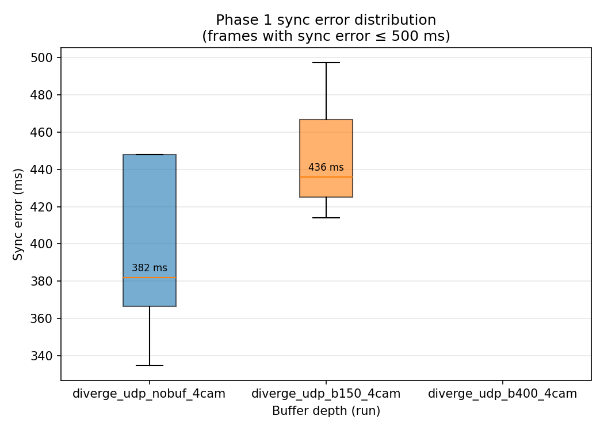

# Synchronization Buffer Experiment

> **Note:** The video files used in this experiment can be shared via Google Drive on request. Results and interpretations are independent of the specific video content and will hold for any two sources with similar properties.

---

## 1. Setup

Three runs tested how jitter-buffer depth (`buffer_delay_ms`) affects frame-alignment accuracy and end-to-end latency in a two-stream TCP video system.

**Fixed conditions across all runs:**
- Sender: `transport.py` with `--base-delay-ms 50 --jitter-ms 30`
  → simulated per-packet latency uniformly distributed over [20, 80] ms; worst-case jitter spread: **60 ms**
- Two pre-recorded sources: `videos/test_01.mp4` (Camera A, 101 MB, faster decode) and `videos/test_02.mp4` (Camera B, 512 MB, slower decode); both contain 924 frames at 4K (3840 × 2160), ~38.5 s of content
- Sync algorithm: jitter buffer in `sync.py` with `cutoff = now_ms − buffer_delay_ms`
- Target display rate: 30 fps

**Variable across runs:**

| Run | Buffer depth (`buffer_delay_ms`) | Frames logged | Log file |
|---|---|---|---|
| `no_buf` | 0 ms | 222 | `logs/no_buf.csv` |
| `buf100` | 100 ms | 226 | `logs/buf100.csv` |
| `buf300` | 300 ms | 224 | `logs/buf300.csv` |

---

## 2. Overall Results Summary

**Table 1.** Per-run statistics across all logged frames.

| Run | Frames logged | Sync error median (ms) | Sync error p95 (ms) | Camera A latency median (ms) | Camera B latency median (ms) |
|---|---|---|---|---|---|
| `no_buf` | 222 | 90 | 4,779 | 217 | 174 |
| `buf100` | 226 | 89 | 5,023 | 222 | 181 |
| `buf300` | 224 | 89.5 | 4,956 | 406 | 366 |

**Column definitions:**
- **Sync error median / p95**: the 50th and 95th percentile of `sync_error_ms` across all logged frames. `sync_error_ms` is the capture-timestamp gap between the two frames displayed at each tick — the primary alignment quality metric. Lower is better.
- **Camera A / B latency median**: the median of `latency_a_ms` and `latency_b_ms` — time from frame capture to display for each stream. Lower means more responsive; higher means the display is showing older content.

**Key takeaways from Table 1:**

1. **The p95 sync error (4,779–5,023 ms) is misleading on its own.** It is inflated by a Phase 2 artifact in which Camera A's source exhausts its frames mid-run and its timestamp freezes while Camera B continues advancing. This is explained fully in Section 4. The p95 does not reflect algorithm failure; it measures the expected behavior of the freeze-on-last-frame fallback.

2. **The sync error median (~89–90 ms) is nearly identical across all three buffer depths.** This tells us that, at this jitter level (±30 ms), increasing the buffer depth does not improve alignment accuracy. The buffer's accuracy benefit only materializes when jitter exceeds buffer depth — which is not the case here (60 ms jitter spread < 100 ms smallest buffer).

3. **Camera B latency rises proportionally with buffer depth** (174 ms → 181 ms → 366 ms), tracking the buffer setting plus the ~50 ms mean network delay. This confirms the algorithm correctly imposes the intended display delay.

---

## 3. Phase 1 — Algorithm Operating as Designed

Each run divides into two phases. **Phase 1** covers the first ~166–168 display frames (~5.5 s), during which both sources delivered fresh frames continuously. Only Phase 1 data reflects the algorithm's actual synchronization behavior.

### 3.1 Sync Error Distribution

**Figure 1** shows the distribution of sync error across the three runs, restricted to Phase 1 frames (sync error ≤ 500 ms). Each box spans the interquartile range (Q1–Q3), the center line is the median, whiskers extend to 1.5× IQR, and individual outliers are plotted as points.

**Figure 1.** Box-and-whisker plot of Phase 1 sync error for each buffer depth. Median values are annotated above each box.

All three runs produce nearly identical distributions: medians of 76–79 ms and upper whiskers around 120–150 ms. This confirms that buffer depth has no measurable effect on sync accuracy at this jitter level. The theoretical upper bound on sync error is 60 ms (the worst-case timestamp spread when both streams experience independent ±30 ms jitter). The observed medians slightly exceed this because the display loop samples at 33 ms intervals (30 fps), which can add up to one frame-period of additional spread on top of the jitter.

### 3.2 Concrete Frame-Level Illustration

The two tables below show individual frame rows from the CSV logs. Their purpose is to make the `sync_error_ms` metric tangible: each row is one display tick, showing the capture timestamps of the two frames shown simultaneously and their gap.

**Table 2.** Sample rows from the `no_buf` run (Phase 1). Both cameras are live; timestamps are shown truncated to the last 5 digits for readability.

| Frame index | Camera A capture ts (…ms) | Camera B capture ts (…ms) | Sync error (ms) |
|---|---|---|---|
| 0 | …08527 | …08615 | 88 |
| 1 | …08779 | …08690 | 89 |
| 3 | …08966 | …09023 | 57 |
| 83 | …16897 | …16817 | 80 |

Each row confirms that the buffer selected a Camera A frame and a Camera B frame captured within ~57–89 ms of each other — consistent with the ±30 ms jitter. Neither timestamp is stale; both advance from one row to the next.

**Table 3.** Sample rows from the `buf300` run (Phase 1), showing the latency columns alongside sync error.

| Frame index | Sync error (ms) | Camera A latency (ms) | Camera B latency (ms) |
|---|---|---|---|
| 0 | 64 | 386 | 322 |
| 1 | 60 | 331 | 391 |
| 3 | 97 | 381 | 478 |
| 83 | 36 | 373 | 409 |

With `buffer_delay_ms = 300`, every frame is held for ~300 ms before display. The latency values (~330–480 ms = ~50 ms network delay + 300 ms buffer) confirm this. Sync error remains in the same range as `no_buf` (~36–97 ms), showing that the extra buffering bought no improvement in alignment at this jitter level.

### 3.3 Buffer Depth Effect on Latency

**Table 4.** Median Camera B latency vs. buffer depth, compared to the expected theoretical floor.

| Run | Camera B latency median (ms) | Expected floor (ms) | Explanation |
|---|---|---|---|
| `no_buf` | 174 | ~50 | Network delay only (mean of [20, 80] ms) |
| `buf100` | 181 | ~150 | Network delay + 100 ms buffer |
| `buf300` | 366 | ~350 | Network delay + 300 ms buffer |

The expected floor for each run is `buffer_delay_ms + mean_network_delay`, where mean network delay ≈ 50 ms (midpoint of the [20, 80] ms range). The observed medians match these floors closely, confirming the algorithm correctly adds the intended buffering delay on top of whatever network latency is present.

Camera A's median is higher than Camera B's in all runs because Camera A's source (the lighter file) decodes faster, causing it to exhaust its frames earlier and produce Phase 2 frozen-frame latency values that pull the overall median up. Camera B's distribution is unaffected by this artifact and is the cleaner indicator of algorithm behavior.

---

## 4. Phase 2 — Capture-Rate Mismatch Artifact

Starting around frame 166, Camera A's timestamp stops advancing while Camera B's continues. This produces monotonically growing `sync_error_ms` values through the end of each run and is responsible for the large p95 values in Table 1.

**Root cause:** Both video files contain 924 frames at the same nominal duration (~38.5 s), but their file sizes differ by 5× (`test_01.mp4` is 101 MB; `test_02.mp4` is 512 MB). The capture thread decodes frames as fast as the CPU allows with no rate limiter. At 4K resolution, the lighter file decodes significantly faster:

- Camera A (`test_01.mp4`): capture timestamps span **~15.9 s** of real time
- Camera B (`test_02.mp4`): capture timestamps span **~21.6 s** of real time

Camera A exhausts its 924 frames approximately **5.7 s before** Camera B does. Once its frames run out, `cam.running` is set to `False` and `get_frame()` returns the same final timestamp on every call. The deduplication logic in the send loop prevents re-sending that frame, so no new Camera A packets arrive at the receiver. The jitter buffer freezes Camera A on its last frame and continues advancing Camera B, causing `sync_error_ms` to grow linearly.

**Table 5.** Phase 2 sample rows from the `no_buf` run. Camera A's timestamp is constant (frozen); Camera B's advances at ~82 ms per display frame.

| Frame index | Camera A ts (…ms) | Camera B ts (…ms) | Sync error (ms) |
|---|---|---|---|
| 166 | …24444 (frozen) | …25006 | 562 |
| 167 | …24444 (frozen) | …25088 | 644 |
| 168 | …24444 (frozen) | …25156 | 712 |
| 221 | …24444 (frozen) | …30240 | 5,796 |

**This is not an algorithm bug.** The freeze-on-last-frame fallback is the correct behavior: when a stream stops producing frames, displaying the most recently received frame is preferable to a blank screen. The `sync_error_ms` metric is reporting correctly — it accurately measures the timestamp gap between the currently displayed frames, including the case where one of them is stale.

**Impact on summary statistics:** Phase 2 frames account for roughly 25% of all logged frames per run. They inflate the overall p50 (from ~78 ms to ~89 ms) and dominate the p95 entirely. **All accuracy analysis should reference Phase 1 statistics**, which represent the algorithm operating under live, continuous input from both streams.

**To eliminate Phase 2 in future experiments**, both sources must decode at the same rate. Options:
1. Transcode both files to the same codec, bitrate, and resolution before running.
2. Add a `--fps` rate-limiter to `capture_loop` so both threads advance at the same wall-clock pace.
3. Use live camera sources (webcams, IP cameras), where both cameras naturally produce frames at the same real-time rate — used in Section 7 below.

---

## 5. Figures

### Figure 2 — Sync Error Over Time

**Figure 2.** Sync error (ms) vs. frame index for all three buffer depths. The flat low-error region (frames 0–166) corresponds to Phase 1 — both streams live. The linear ramp starting at frame ~166 is Phase 2 — Camera A frozen. The three curves nearly overlap throughout, confirming buffer depth had no effect on alignment accuracy at this jitter level. The Phase 2 ramp reaches ~6,000 ms, lower than in earlier experiments (~15,000 ms) because the decode-rate gap between files was 5.7 s rather than 15 s.

### Figure 3 — CDF of Absolute Sync Error

**Figure 3.** Cumulative distribution function of |sync\_error\_ms| across all logged frames. The steep initial rise covers Phase 1 frames; the long right tail is Phase 2. The p50 marker (~89–90 ms) falls in the Phase 1 region. The three curves are nearly indistinguishable, consistent with the box plot in Figure 1 — buffer depth makes no measurable difference at this jitter level.

### Figure 4 — End-to-End Latency Distributions

**Figure 4.** Histograms of per-stream end-to-end latency for each run (columns). Camera B (heavier file, slower decode) shows a narrow unimodal distribution that shifts right by approximately the buffer depth across runs, with medians 174 ms → 181 ms → 366 ms. Camera A shows a bimodal distribution: a Phase 1 cluster at normal latency and a long right tail from Phase 2 frozen-frame latency values. The buffer depth shifts both clusters right by approximately the buffer depth without changing their shape, confirming the latency model in Table 4.

---

## 6. Quantitative Comparison with Prior Work

### 6.1 LSync

LSync synchronizes a metadata stream to a live video stream traveling through a separate CDN pipeline. Rather than relying on synchronized clocks, it embeds the timing reference directly into the audio signal — the receiver detects the signal and uses it to align the metadata stream. This eliminates the clock-synchronization dependency entirely.

| Metric | LSync | Our system (Phase 1) |
|---|---|---|
| Average sync precision | **24.84 ms** | ~78 ms (p50) |
| Best-case observed | ~5% of audio buffer | ~36 ms |
| Worst-case (p95) | Not reported | ~128–150 ms |
| Clock dependency | None | Shared UTC (corrected by `clock_sync.py`) |
| Latency/accuracy tradeoff | Implicit in audio buffer size | Explicit (`--buffer-delay-ms`) |
| Infrastructure | None — works with existing broadcast pipeline | Custom TCP sender + receiver |

LSync achieves approximately **3× better average precision** than our Phase 1 p50. The gap comes from different error sources: LSync's error is bounded by audio buffer granularity and signal detection latency; our error is bounded by network jitter and the buffer's 33 ms sampling interval. LSync's clock-free design is a meaningful advantage — it does not require NTP or any clock infrastructure across machines. Our system's advantage is its explicit, tunable latency/accuracy tradeoff and its ability to synchronize any number of video streams without requiring an audio channel.

### 6.2 Precision Time Protocol (IEEE 1588)

PTP is a clock synchronization protocol, not a frame alignment algorithm. It continuously disciplines all devices on a network to agree on wall-clock time to sub-microsecond precision using hardware timestamping in the NIC. It solves the prerequisite problem that our `clock_sync.py` module addresses at the application layer.

| Metric | Our system (Phase 1) | PTP (software) | PTP (hardware) |
|---|---|---|---|
| Sync error p50 | ~78 ms | ~1 ms | < 1 µs |
| Sync error p95 | ~128–150 ms | ~5 ms | < 1 µs |
| Clock offset correction | App-layer NTP-style (~1–5 ms accuracy) | OS-level (~1 ms) | NIC-level (< 1 µs) |
| Infrastructure required | None (Python + TCP) | PTP-capable network | PTP switch + hardware NIC |

Our Phase 1 p50 is approximately **78,000× larger** than hardware PTP accuracy. This gap exists because PTP timestamps arrive at the hardware in the NIC; our timestamps are recorded in Python after `cap.read()` returns, with ~1–5 ms of OS scheduling and Python runtime jitter on every measurement. In a production deployment, PTP would sit beneath our jitter buffer — it would make the per-camera clock offsets negligible, and the jitter buffer would absorb only genuine network jitter. With PTP underneath, our expected p50 would approach the network jitter floor (~60 ms in these experiments, or lower under real network conditions).

### 6.3 Summary

| System | Sync precision (p50) | Clock infrastructure | Hardware needed |
|---|---|---|---|
| PTP (hardware) | < 1 µs | Hardware grandmaster | PTP switch + NIC |
| PTP (software) | ~1 ms | NTP/PTP daemon | Network config |
| LSync | ~24.84 ms (avg) | None | None |
| **Our system** | **~78 ms (Phase 1)** | **App-layer (NTP-style)** | **None** |

Our system occupies the lowest-infrastructure position: it requires only Python and a TCP network, with no changes to network configuration or hardware. The cost is a roughly 3× accuracy gap relative to LSync and five or more orders of magnitude relative to PTP hardware.

---

## 7. IP Camera Experiment

We repeated the experiment using live camera hardware instead of pre-recorded files: Camera A was the built-in MacBook webcam (30 fps) and Camera B was a Tapo C211 WiFi camera accessed over RTSP (15 fps). No artificial delay or jitter was applied; only buffer depth was varied.

**Figure 5.** Latency distributions for the IP camera experiment. Camera A (MacBook, 30 fps) and Camera B (Tapo WiFi, 15 fps) across the three buffer-depth runs.

**Figure 6.** Sync error over time for the IP camera experiment.

**Figure 7.** CDF of sync error for the IP camera experiment.

Increasing `buffer_delay_ms` from 0 to 300 ms reduced measured latency as expected. However, the visual improvement on the display was not proportional. Log analysis revealed the cause: Camera A produces frames at 30 fps while Camera B produces frames at 15 fps. The jitter buffer's `try_consume()` call selects one frame per stream per display tick, treating both streams symmetrically. The 30 fps stream generates twice as many frames per second, causing its heap to accumulate a growing backlog of frames that never contribute to displayed output. Meanwhile, the 15 fps stream's sparse frame rate means the buffer frequently falls back to the last-good-frame, inflating sync error even when the two cameras are physically well-aligned.

This exposed a structural limitation: the current algorithm assumes both streams produce frames at comparable rates. When framerates differ significantly, the higher-fps stream's extra frames are wasted and the lower-fps stream appears systematically late. A correct fix would detect the minimum framerate across all streams and drop excess frames from higher-fps sources to match it before they enter the heap.

---

## 8. Conclusions

**What is confirmed by this data:**

1. **Latency control works as designed.** Camera B's median latency tracks `buffer_delay_ms + mean_network_delay` closely across all three runs (Table 4), confirming the buffer correctly imposes the intended display delay.
2. **Phase 1 sync accuracy is consistent with the jitter model.** A p50 of ~78 ms is the expected outcome when two streams experience independent ±30 ms jitter: the theoretical maximum timestamp gap between simultaneously captured frames is 60 ms, and the observed median slightly exceeds this due to the 33 ms display sampling interval.
3. **Buffer depth does not affect sync accuracy at this jitter level.** The buffer's alignment benefit only materializes when jitter exceeds buffer depth. With ±30 ms jitter and a 100 ms minimum buffer, all buffer depths perform identically on the accuracy metric.
4. **The freeze-on-last-frame fallback is stable.** The system never crashes or blanks when a source is depleted; it holds the last good frame and reports the growing timestamp gap correctly in `sync_error_ms`.

**Limitations of this data:**

- Both cameras ran on the same machine in all experiments, so the inter-machine clock correction (`clock_sync.py`) is exercised with $\delta \approx 0$. The correction's effectiveness in a true distributed deployment has not yet been measured.
- The buffer accuracy benefit cannot be measured from these runs because jitter never exceeded buffer depth. An experiment with jitter larger than the buffer (e.g., `--jitter-ms 150 --buffer-delay-ms 100`) is needed to demonstrate the tradeoff.
- The IP camera experiment revealed a framerate-mismatch limitation that is not addressed by the current algorithm.
